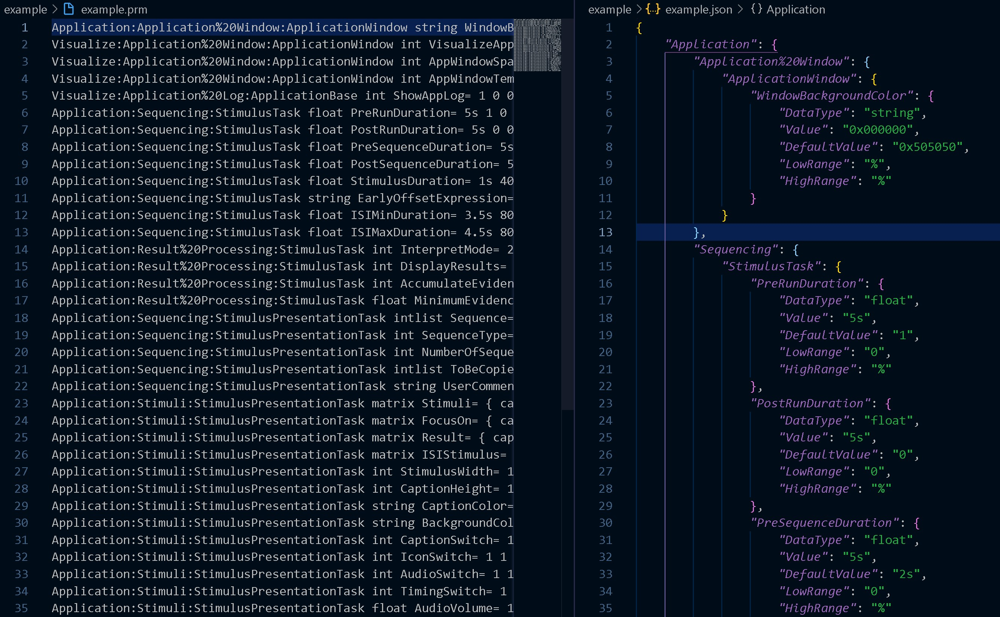

Convert BCI2000 .prm files to json files and back again.

### To do:
- The "back again" part
- Handle intlist/matrix datatypes
- Testing

[BCI2000 Parameter Reference](https://www.bci2000.org/mediawiki/index.php/Technical_Reference:Parameter_Definition)
